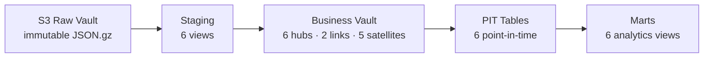

# cloud-dw-datavault

A lean, free-tier-friendly data platform on AWS. Lands full JSON payloads from 6 public APIs into an S3 Raw Vault, then normalizes them with DuckDB + dbt into a Data Vault 2.0 Business Vault (hubs, links, satellites, PIT tables) for analytics. Orchestrated via Dagster, visualized via Metabase, CI via GitHub Actions.

**[Architecture](docs/ARCHITECTURE.md)** · **[Data Models](docs/DATA_MODELS.md)** · **[Deployment](docs/DEPLOYMENT.md)** · **[Testing](docs/TESTING.md)** · **[Ingestion](docs/INGESTION.md)**

---

## Quick start

```bash
# 1. Provision infra
cd infra/terraform
terraform init && terraform apply -auto-approve

# 2. SSH to EC2
ssh -i ~/.ssh/<key>.pem ec2-user@$(terraform output -raw ec2_public_dns)

# 3. Clone and configure
cd ~/cloud-dw-datavault
echo 'export PYTHONPATH=$(pwd)' >> ~/.bashrc && source ~/.bashrc
echo 'export PATH="$HOME/.local/bin:$PATH"' >> ~/.bashrc && source ~/.bashrc
export HTTP_APP_NAME="cloud-dw-datavault"
export HTTP_CONTACT="mailto:you@yourcompany.com"

# 4. Run ingestion (6 sources)
python3 -m ingestion.extract_worldbank --indicator SP.POP.TOTL --country ZA
python3 -m ingestion.extract_weather --lat -26.2041 --lon 28.0473 --hourly temperature_2m,relativehumidity_2m
python3 -m ingestion.extract_wikimedia --project en.wikipedia.org --article Nelson_Mandela --access all-access --agent all-agents --granularity daily --start 20250101 --end 20250107
python3 -m ingestion.extract_github --owner octocat --repo Hello-World
python3 -m ingestion.extract_openaq --sensor_id 3917 --resource measurements --limit 500
python3 -m ingestion.extract_usgs --feed all_day

# 5. Build the data vault
sudo mkdir -p /opt/data && sudo chown ec2-user:ec2-user /opt/data
dbt debug --project-dir dbt
dbt build

# 6. Start Metabase
docker run -d --name metabase -p 3000:3000 \
  -v /opt/data:/metabase-data -e MB_DB_FILE=/metabase-data/metabase.db metabase/metabase:latest

# 7. Start Dagster
dagit -m orchestration.dagster.dw_pipeline --port 3001
```

---

## Data sources

| Source | API | Model | Granularity |
|--------|-----|-------|-------------|
| **World Bank** | Indicators v2 | `stg_worldbank` | Yearly |
| **Open-Meteo** | Weather forecast | `stg_openmeteo` | Hourly |
| **Wikimedia** | Pageviews REST | `stg_wikimedia` | Daily |
| **GitHub** | Commits REST | `stg_github` | Per commit |
| **OpenAQ** | Sensor v3 | `stg_openaq` | Per reading |
| **USGS** | Earthquake GeoJSON | `stg_usgs` | Per event |

---

## Data Vault layers



| Layer | Contents |
|-------|----------|
| **Raw Vault** | Immutable gzipped JSON payloads in S3, organized by source |
| **Staging** | `stg_*.sql` — normalize JSON via `read_json_auto()` |
| **Business Vault** | Hubs, links, satellites with SHA-256 hash keys; insert-only change tracking |
| **PIT Tables** | `pit_*.sql` — pre-joined temporal snapshots at common grains |
| **Marts** | `*.sql` views joining PITs with hubs and links for analytics |

---

## Hashing standard

All keys use SHA-256 with trimmed, uppercased inputs:

```sql
-- Single key (hubs)
SHA-256(UPPER(TRIM(business_key)))

-- Composite key (links)
SHA-256(UPPER(TRIM(key1)) || '|' || UPPER(TRIM(key2)))

-- Natural key (satellites)
SHA-256(UPPER(TRIM(key1)) || '|' || UPPER(TRIM(key2)) || '|' || UPPER(TRIM(time_dim)))

-- Change detection (satellites)
SHA-256(UPPER(TRIM(
  COALESCE(CAST(attr1 AS VARCHAR), 'NULL') || '|' ||
  COALESCE(attr2, 'NULL') || '|' || ...
)))
```

---

## Repository

```
cloud-dw-datavault/
├── .github/workflows/     # CI (dbt parse, python lint, integration)
├── infra/terraform/       # S3, IAM, EC2
├── ingestion/             # Python extractors (6 sources)
│   └── common/            # Shared config, S3 utils
├── dbt/
│   ├── models/
│   │   ├── staging/       # Normalize raw JSON to flat views
│   │   ├── raw_vault/     # Raw vault schema placeholder
│   │   ├── business_vault/
│   │   │   ├── hubs/      # Unique business keys
│   │   │   ├── links/     # Many-to-many relationships
│   │   │   ├── satellites/# Descriptive attributes (insert-only)
│   │   │   └── pit/       # Point-in-time snapshot tables
│   │   └── marts/         # End-user analytics views
│   └── macros/            # hash_key, hash_diff
├── orchestration/dagster/ # Dagster pipeline
├── docs/                  # Full documentation
└── requirements.txt
```

---

## CI/CD

Three GitHub Actions jobs run on every push and PR:

| Job | What it does | Requires AWS |
|-----|-------------|:---:|
| `dbt-parse` | Validates all SQL and Jinja in dbt models | No |
| `python-lint` | Ruff lint + format check on ingestion/ | No |
| `dbt-integration` | Full `dbt build` against live S3 data | Yes |

Plus a Terraform workflow (`fmt` → `init` → `validate` → `plan`).

See [docs/DEPLOYMENT.md](docs/DEPLOYMENT.md) for setup details.

---

## Production checklist

- Restrict `ssh_ingress_cidr` to your IP range
- Enable S3 lifecycle (transition to Glacier after 30-60 days)
- Enable S3 SSE on the raw vault bucket
- Set AWS Budgets ($5-10/month alerts)
- Configure Metabase authentication
- Set up CloudWatch agent for EC2 metrics

---

## Troubleshooting

**`hash_key is undefined`** — Ensure `dbt/macros/hash_key.sql` and `hash_diff.sql` exist; re-run `dbt parse`.

**`403 / 429` on Wikimedia** — Set `HTTP_APP_NAME` and `HTTP_CONTACT` env vars for the User-Agent header.

**Source selection errors** — Use `source:` (singular) or `path:` selectors in dbt; `sources:` is not valid.

**DuckDB can't read S3** — Ensure `httpfs` extension is loaded and AWS credentials are available via env vars, instance role, or profiles.yml settings.

---

## License & contributions

PRs welcome for new sources, marts, dashboards, and CI improvements.

## Acknowledgements

Thanks to the teams behind DuckDB, dbt, Dagster, and the open API providers (World Bank, Wikimedia, Open-Meteo, USGS, GitHub, OpenAQ).
