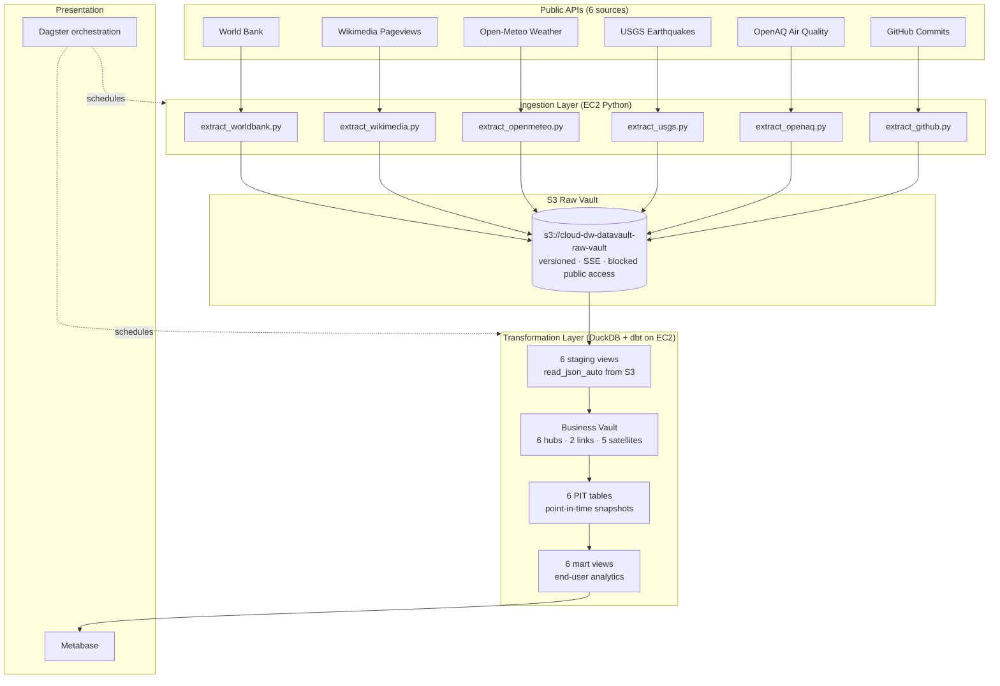
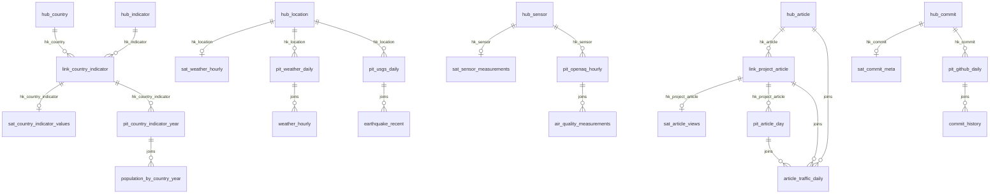
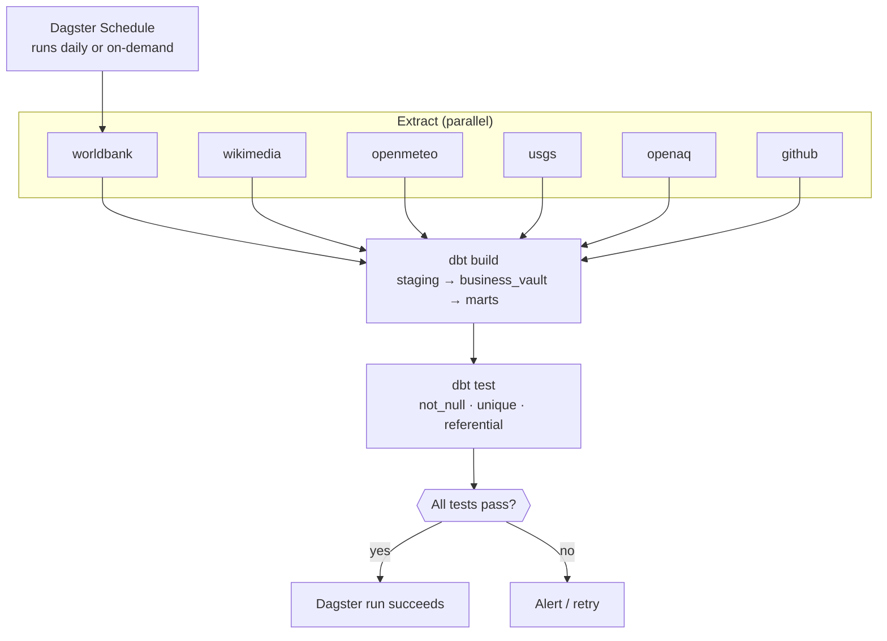

# Architecture

## Overview

cloud-dw-datavault is a free-tier-friendly data platform on AWS that implements the Data Vault 2.0 methodology. It ingests full JSON payloads from six public APIs into an S3 Raw Vault, then transforms them using DuckDB and dbt into a Business Vault with hubs, links, satellites, and PIT (Point-In-Time) tables for analytics.

## System Architecture



## Data Vault 2.0 Layers

```mermaid
flowchart LR
    subgraph L1["Layer 1 — Raw Vault"]
        S3_RAW["Immutable JSON payloads in S3<br/>gzipped · versioned · organized by source"]
    end

    subgraph L2["Layer 2 — Staging"]
        STG_V["stg_worldbank · stg_wikimedia · stg_openmeteo<br/>stg_usgs · stg_openaq · stg_github"]
    end

    subgraph L3["Layer 3 — Business Vault"]
        direction TB
        HUBS["Hubs<br/>hub_country · hub_indicator · hub_article<br/>hub_commit · hub_location · hub_sensor"]
        LINKS["Links<br/>link_country_indicator<br/>link_project_article"]
        SATS["Satellites<br/>sat_country_indicator_values · sat_article_views<br/>sat_weather_hourly · sat_commit_meta<br/>sat_sensor_measurements"]
    end

    subgraph L4["Layer 4 — PIT Tables"]
        PITS["pit_article_day · pit_country_indicator_year<br/>pit_weather_daily · pit_openaq_hourly<br/>pit_usgs_daily · pit_github_daily"]
    end

    subgraph L5["Layer 5 — Marts"]
        MARTS_V["article_traffic_daily · population_by_country_year<br/>weather_hourly · air_quality_measurements<br/>earthquake_recent · commit_history"]
    end

    L1 --> L2 --> L3 --> L4 --> L5
```



## Entity-Relationship Diagram



## Orchesration DAG



## Hashing Standard

All hash keys use SHA-256 with standardized inputs:

```
SHA-256(UPPER(TRIM(business_key)))
```

For composite keys in links:
```
SHA-256(UPPER(TRIM(key1)) || '|' || UPPER(TRIM(key2)))
```

For natural keys in satellites:
```
SHA-256(UPPER(TRIM(key1)) || '|' || UPPER(TRIM(key2)) || '|' || UPPER(TRIM(time_dimension)))
```

Hash diffs for change detection:
```
SHA-256(UPPER(TRIM(
  COALESCE(CAST(attr1 AS VARCHAR), 'NULL') || '|' ||
  COALESCE(attr2, 'NULL') || '|' || ...
)))
```

## Data Flow

1. **Extraction**: Python scripts call public APIs, store full JSON in S3 with gzip compression.
2. **Staging**: dbt runs DuckDB `read_json_auto()` against S3 globs to parse JSON into views.
3. **Business Vault**: Hubs, links, and satellites are built from staging views using hash keys.
4. **PIT**: Point-in-time tables aggregate satellite data at standard time grains.
5. **Marts**: Analytics views join hubs, links, and PIT tables for end-user queries.
6. **Orchestration**: Dagster schedules extraction → dbt build → testing in sequence.

## Security Design

- S3 Block Public Access enabled (all four settings)
- IAM roles with least privilege (S3 access limited to raw vault bucket)
- API keys via environment variables, never in source code
- EC2 instance profile for credential-free AWS access
- S3 versioning for immutable audit trail
- gzip compression on all stored payloads

## Cost Optimization

- t3.micro EC2 (free tier eligible)
- S3 lifecycle policies can transition to IA/Glacier after 30-60 days
- DuckDB runs locally (no database server costs)
- Metabase runs on the same EC2 instance via Docker
- All tools are open source
